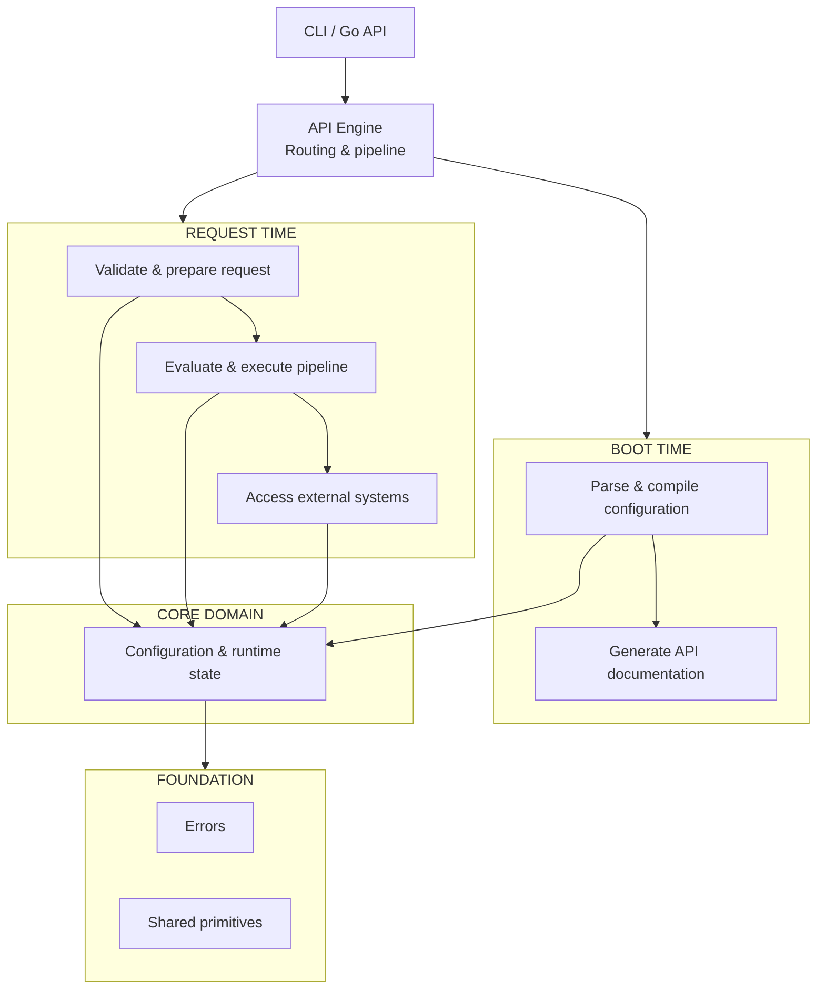

# Contributing to hclapi

Thanks for helping build `hclapi`. This codebase is kept simple, fast, and easy to maintain. It tries to follow most of the principles described in [Effective Go](https://go.dev/doc/effective_go).

## Documentation

Full project documentation is available at [ju4n97.github.io/hclapi](https://ju4n97.github.io/hclapi/).

The documentation is written in [MDX](https://mdxjs.com/), using [Rspress](https://rspress.rs/).

It's recommended that you read this documentation before contributing to have full context and understanding of this project.

## How the engine works

1. **Startup:** When `hclapi serve` starts, it walks the manifest directory, parses `.hcl` files into an AST, compiles routes, initializes database connection pools, and binds endpoints to Go's standard `http.ServeMux`.
2. **Request time:** Each incoming HTTP request creates an isolated `ExecutionContext` and executes pipeline steps sequentially (`sql`, `starlark`, `go`, etc.) until a `respond` step terminates the pipeline and sends the response.

## Project structure

```sh
hclapi/
├── cmd/hclapi/                 # CLI: serve, openapi, version
├── hclapi.go                   # Public Go library facade
└── internal/
    ├── manifest/               # Static config models
    ├── runtime/                # Request execution state
    ├── scalar/                 # Primitive units & conversions
    ├── problem/                # RFC 9457 problem detail errors
    ├── parser/                 # HCL parsing & AST
    ├── compiler/               # Static analysis & route compilation
    ├── validator/              # Schema validation & defaults
    ├── eval/                   # Expression evaluation & built-ins
    ├── openapi/                # OpenAPI 3.1 & documentation
    ├── connectors/             # Database connectivity
    ├── steps/                  # xgo, xstarlark, xsql, xrespond, etc.
    └── engine/                 # Dispatcher & pipeline runner
```

## Architectural dependency graph

In order to avoid circular dependencies and maintain clear boundaries, package imports form a strict Directed Acyclic Graph (DAG) flowing from leaf primitives up to the orchestrator and binaries:



### Dependency rules

- Leaf packages such as `internal/scalar` and `internal/problem` depend only on the Go standard library and never import internal application code.
- Dependencies flow strictly in one direction, with lower-level packages never knowing about the packages that import them; for example, `internal/manifest`, which provides boot-time static configuration, never imports `internal/runtime`, which handles request-time dynamic execution.
- Step runners in `internal/steps/` are decoupled execution units that never import one another or `internal/engine`.
- Nothing under `internal/` can import `github.com/ju4n97/hclapi`, as the root package serves purely as the public facade.

## Key engineering rules

- A single, cross-compilation binary is maintained with zero CGO dependencies. All database drivers must be pure Go.
- Avoid implicit fallbacks or hidden state. All steps export data under explicit keys (`.rows`, `.row`, `.value`, `.result`, etc.).
- Never mutate shared request state across step handlers.
- Invalid syntax, malformed durations, or broken connection URLs must fail immediately on startup with clear error messages, never during customer requests.

## Git workflow

`hclapi` uses trunk-based development. Keep pull requests focused on a single logical change. Merge commits are fine.

### Conventional commits

Commit messages should follow [Conventional Commits](https://www.conventionalcommits.org/) (e.g. `feat(parser): ...`, `fix(sql): ...`, `chore: ...`). This is needed because release changelogs are generated automatically from commit prefixes.

Always open an issue for discussion before submitting a PR containing a breaking change and when committing a breaking change, append an exclamation mark (`!`) before the colon in the commit subject: `type(scope)!: description` to ensures the automated release pipeline flags it properly in the changelog and describe the exact migration steps in the commit body under a `BREAKING CHANGE:` footer.

## Development workflow

This project uses [Taskfile](https://taskfile.dev) to manage common tasks:

```bash
# Run linters
task lint

# Format code and documentation
task fmt

# Run fast unit tests (in-memory SQLite, no Docker needed)
task test

# Run tests with the Go race detector
task test-race

# Run integration tests against real databases (requires Docker)
task test-integration

# Fast local compilation for current OS/Arch
task build

# Compile matrix binaries across all supported platforms (requires goreleaser)
task build-all
```

## Release process

Releases are fully automated via GitHub Actions and [GoReleaser](https://goreleaser.com).

### Versioning convention

`hclapi` adheres to [Semantic Versioning 2.0.0](https://semver.org/). All release tags must start with a lowercase `v` prefix (e.g., `v0.1.0`, `v0.2.0`).

### 1. Pre-release verification

Before publishing a release, ensure all verifications pass cleanly on `main`:

```bash
task lint
task test
task test-race
task test-integration
```

### 2. Local dry run (optional)

Simulate the full release lifecycle locally without publishing to GitHub or registries:

```bash
task release-dry-run
```

### 3. Publishing a release

To publish a release, create and push an annotated Git tag to `origin`.

Using the helper task:

```bash
task tag -- v0.1.0
```

Or using manual Git commands:

```bash
git tag -a v0.1.0 -m "Release v0.1.0"
git push origin v0.1.0
```

### 4. Automated pipeline execution

Pushing the tag triggers the `.github/workflows/release.yml` workflow, which automatically:

1. Compiles static binaries for all supported platforms (Linux, macOS, Windows, FreeBSD on `amd64` and `arm64`).
2. Bundles documentation files (`README.md`, `LICENSE`, etc.) into `.tar.gz` and `.zip` archives.
3. Computes cryptographic SHA-256 digests into `checksums.txt`.
4. Builds and pushes multi-architecture OCI container images (`linux/amd64` and `linux/arm64`) to GitHub Container Registry (`ghcr.io/ju4n97/hclapi`).
5. Generates the categorized release changelog and attaches all artifacts to the new GitHub release.

## Using AI

AI tools are fine to use for drafting code, writing tests, or exploring approaches. The main expectation is that all contributions fit the architecture and meet the same quality standards as manual work.

**For code and verification:**

Submitted code should be tested, verified, and well understood by the author.

**For communication:**

Pull request descriptions, issue comments, and commit messages are best kept in plain, direct language. A few straightforward sentences explaining the change are more helpful for review than long generated summaries.

**For documentation:**

Documentation in `hclapi` is kept concise, accurate, and grounded in the actual codebase. Short, clear explanations are preferred over large blocks of generated text that add little practical context.

## Project configuration

The repository is kept focused on `hclapi` itself. Configuration files that only serve individual editors, personal workflows, or local AI tooling are best kept in local ignore rules rather than tracked in Git.

This includes directories and files such as `.vscode/`, `.zed/`, `.cursor/`, `CLAUDE.md`, `AGENTS.md`, or similar personal setup files.

Project configuration is committed only when it provides a clear, shared benefit to everyone working on the codebase.

## License

By contributing to `hclapi`, you agree that your contributions will be licensed under the project's [MIT License](LICENSE).
