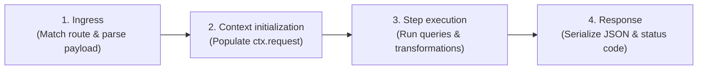
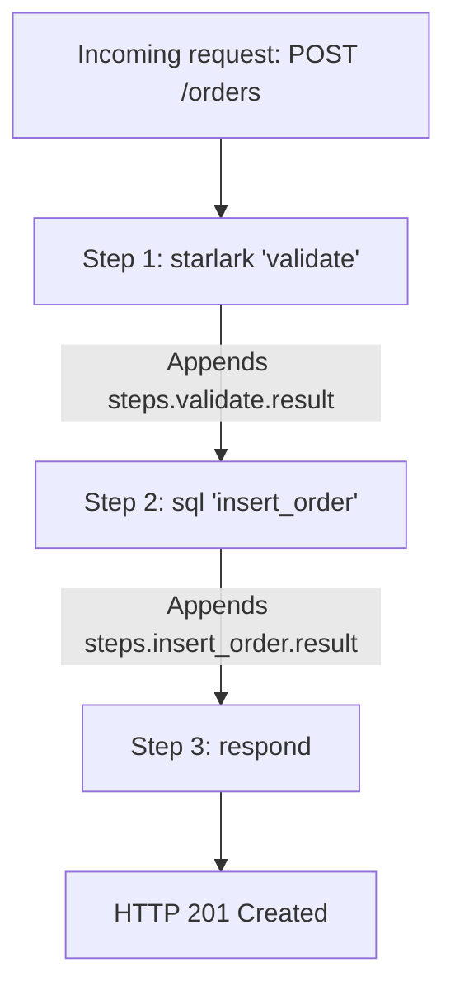
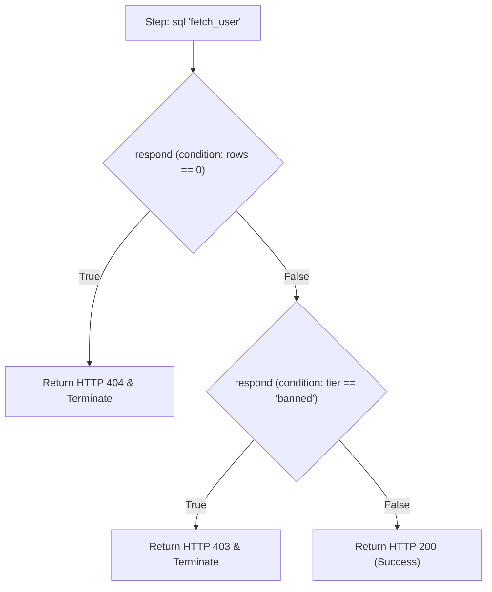

# The mental model & lifecycle

## The request lifecycle

Every incoming HTTP request travels through a predictable four-stage lifecycle:

1. **Ingress**: The engine matches the incoming HTTP method and path template (e.g. `GET /accounts/{id}`) and parses headers, query parameters, and JSON payloads.
2. **Context initialization**: An isolated execution context (`ctx`) is instantiated specifically for that request.
3. **Step execution**: The pipeline executes declared steps in order from top to bottom. Each step reads from the context and appends its computed result.
4. **Response**: A `respond` step formats the final HTTP payload and status code, terminating the pipeline.

## How steps pass data

Pipelines share data through the execution context (`ctx`). Data only flows in one direction: **downward**.

### Context data structure

At any point in the pipeline, steps have access to two namespaces:

* **`ctx.request`**: The immutable data from the client:
  * `ctx.request.method`: The HTTP verb (e.g. `"POST"`).
  * `ctx.request.path`: Path parameters (e.g. `ctx.request.path.id`).
  * `ctx.request.query`: Query parameters (e.g. `ctx.request.query.filter`).
  * `ctx.request.headers`: HTTP request headers.
  * `ctx.request.body`: The unmarshaled request payload.
* **`steps.<name>`**: The outputs generated by previously completed steps:
  * `steps.<name>.result`: The return value of step `<name>`.
  * `steps.<name>.rows_affected`: Query execution count for database mutations.

Steps cannot modify previous step outputs or request data directly; they can only produce new outputs under their own declared name.

## Branching and early exits

Hclapi avoids deeply nested `if/else` configuration blocks by using conditional responses. Multiple `respond` blocks can be declared in a pipeline, each evaluated with a `condition`:

* When a `condition` evaluates to `true`, the engine writes the response immediately and halts the pipeline.
* When a `condition` evaluates to `false`, the step is skipped and execution proceeds to the next step.

This pattern allows error checks, authorization guards, and cache hits to exit early without complex flow control syntax.

## Startup validation vs request execution

Hclapi enforces a strict boundary between what happens when the application starts and what happens during a request:

| Phase | When it happens | What occurs | Failure behavior |
| :--- | :--- | :--- | :--- |
| **Startup (Validation)** | When running `hclapi serve` | Manifests are parsed, connection pools are verified, and route patterns are registered | The server fails immediately with line-number diagnostics. Broken manifests never start |
| **Runtime (Execution)** | When an HTTP request arrives | Request parameters are extracted, pipeline steps execute, and dynamic expressions resolve | Malformed inputs return RFC 9457 Problem Details errors without crashing the server |
