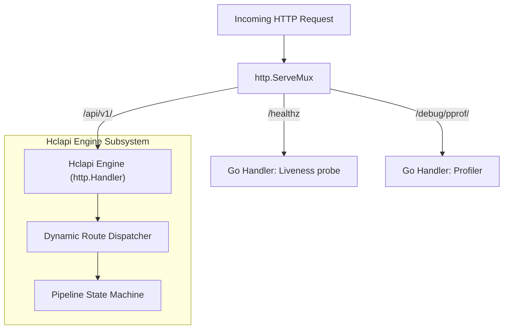

# Embedding in `http.ServeMux`

Hclapi can be embedded directly into standard Go applications as a library. This allows declarative manifest pipelines to coexist with existing Go routers, gRPC gateways, telemetry middleware, and operational health probes.

## Architecture

When used as a library, `hclapi.Engine` implements the standard Go `http.Handler` interface. The engine can be mounted onto standard multiplexers (`http.ServeMux`), custom middleware chains, or third-party routers.



## Basic embedding example

```go
package main

import (
    "context"
    "errors"
    "log/slog"
    "net/http"
    "os"
    "os/signal"
    "syscall"
    "time"

    "github.com/ju4n97/hclapi"
)

func main() {
    logger := slog.New(slog.NewJSONHandler(os.Stdout, nil))

    // 1. Initialize the Hclapi engine
    engine, err := hclapi.NewEngine(hclapi.Options{
        ManifestDir:  "./manifests",
        StrictTyping: true,
        Logger:       logger,
    })
    if err != nil {
        logger.Error("failed to initialize hclapi engine", "error", err)
        os.Exit(1)
    }

    // 2. Mount onto standard Go multiplexer
    mux := http.NewServeMux()

    // Native Go endpoint for operational liveness probes
    mux.HandleFunc("GET /healthz", func(w http.ResponseWriter, r *http.Request) {
        w.Header().Set("Content-Type", "text/plain")
        w.WriteHeader(http.StatusOK)
        w.Write([]byte("OK"))
    })

    // Mount Hclapi declarative routes under /api/v1/ prefix
    mux.Handle("/api/v1/", engine.Handler())

    // 3. Configure HTTP server with timeouts derived from engine
    srvConfig := engine.Server()
    server := &http.Server{
        Addr:         ":8080",
        Handler:      mux,
        ReadTimeout:  srvConfig.ReadTimeout.Duration(),
        WriteTimeout: srvConfig.WriteTimeout.Duration(),
        IdleTimeout:  srvConfig.IdleTimeout.Duration(),
    }

    // 4. Graceful shutdown coordination
    stop := make(chan os.Signal, 1)
    signal.Notify(stop, os.Interrupt, syscall.SIGTERM)

    go func() {
        logger.Info("server listening", "addr", server.Addr)
        if err := server.ListenAndServe(); err != nil && !errors.Is(err, http.ErrServerClosed) {
            logger.Error("server error", "error", err)
            os.Exit(1)
        }
    }()

    <-stop
    logger.Info("shutting down server...")

    ctx, cancel := context.WithTimeout(context.Background(), 5*time.Second)
    defer cancel()

    if err := server.Shutdown(ctx); err != nil {
       logger.Error("forced shutdown error", "error", err)
    }
    logger.Info("server stopped gracefully")
}
```

## Integration with Go middleware

Because `engine.Handler()` returns a standard `http.Handler`, third-party middleware (such as CORS, rate limiting, and OpenTelemetry instrumentation) wraps the engine cleanly:

```go
func loggingMiddleware(next http.Handler) http.Handler {
    return http.HandlerFunc(func(w http.ResponseWriter, r *http.Request) {
        start := time.Now()
        next.ServeHTTP(w, r)
        slog.Info("request completed",
            "method", r.Method,
            "path", r.URL.Path,
            "duration", time.Since(start),
        )
    })
}

func main() {
    engine, _ := hclapi.NewEngine(hclapi.Options{
        ManifestDir: "./config"
    })
 
    // Wrap Hclapi engine in Go middleware chain
    handler := loggingMiddleware(engine.Handler())
 
    http.ListenAndServe(":8080", handler)
}
```
