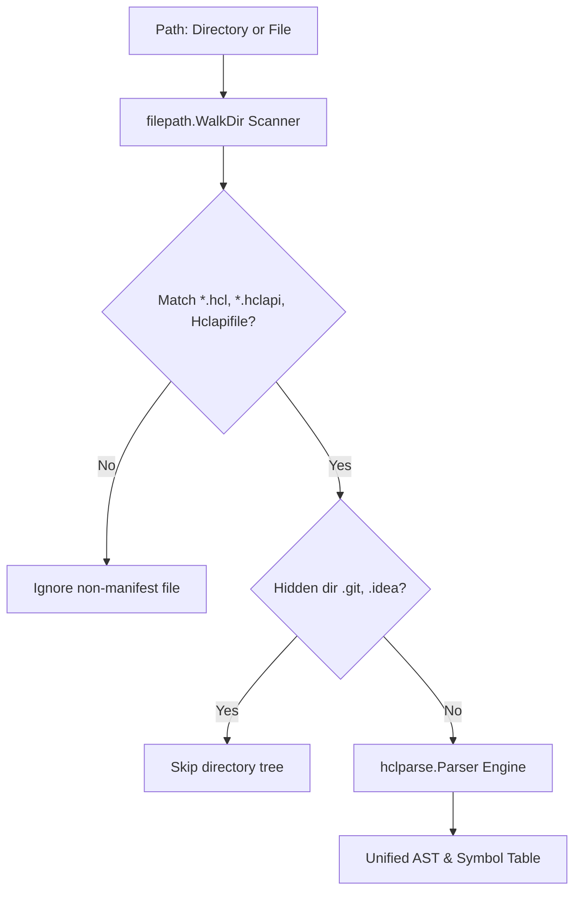

# Compilation & AST

Understanding how Hclapi compiles declarative HCL manifests into an in-memory Abstract Syntax Tree.

## Manifest discovery

## Symbol resolution & verification

All parsed files merge into a unified global symbol table:
* **Connections:** Registered into the connection pool manager.
* **Schemas:** Registered into the validation and OpenAPI generator registries.
* **Endpoints:** Verified for duplicate route collisions and bound to the HTTP multiplexer.

If an endpoint references a non-existent connection (`connection = connection.postgres.missing`) or schema, the compilation phase aborts immediately with a fatal diagnostic error before any network port is opened.
