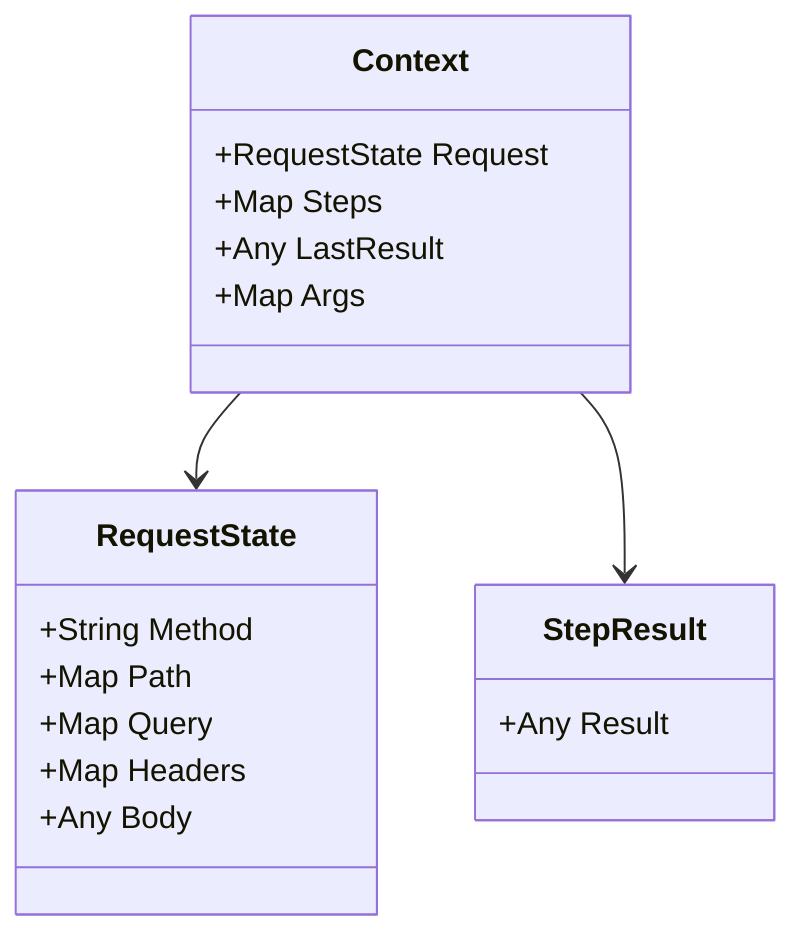

# The context topology

Each incoming HTTP request generates an isolated `Context` struct that flows through the execution pipeline.

## Context hierarchy



## Context structure

```json
{
  "ctx": {
    "request": {
      "method": "POST",
      "path": {
        "user_id": "101"
      },
      "query": {
        "filter": "active",
        "page": "1"
      },
      "headers": {
        "authorization": "Bearer eyJhbGciOi...",
        "content-type": "application/json"
      },
      "body": {
        "email": "user@example.com",
        "name": "Jane Doe"
      }
    },
    "steps": {
      "normalize": {
        "result": {
          "email": "user@example.com",
          "name": "JANE DOE"
        }
      }
    },
    "auth": {
      "claims": {
        "sub": "usr_9981",
        "role": "admin"
      }
    }
  }
}
```

## Field access reference

| Path | Type | Description |
| :--- | :--- | :--- |
| `ctx.request.method` | `string` | HTTP method (`GET`, `POST`, etc.). |
| `ctx.request.path.<name>` | `string` | URL path parameters extracted from `{name}`. |
| `ctx.request.query.<name>` | `string` | URL query parameters. |
| `ctx.request.headers.<name>` | `string` | Canonicalized lower-case HTTP request headers. |
| `ctx.request.body` | `any` | Unmarshaled JSON request payload. |
| `steps.<name>.result` | `any` | Output generated by an upstream named step. |
| `ctx.LastResult` | `any` | Output generated by the immediately preceding step. |
