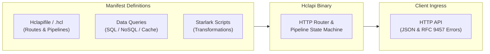
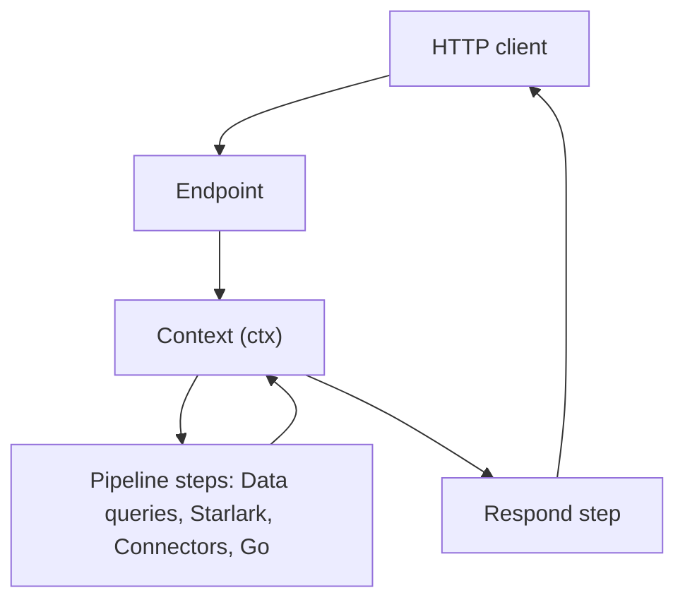

# Introduction

**Hclapi** is a declarative backend engine distributed as a single, cross-platform binary. It turns HashiCorp Configuration Language (HCL) manifests, database queries, and Starlark scripts into production-ready HTTP APIs without requiring an external language runtime or server boilerplate.

## Infrastructure for backends

In modern infrastructure management, tools like Terraform replaced imperative provisioning scripts with declarative configuration files. The desired state of the infrastructure is declared, and the engine manages provisioning, dependency graphs, and state reconciliation.

**Hclapi applies this same philosophy to backend APIs.**

A significant portion of backend development involves repetitive plumbing, like configuring routers, parsing query parameters, unmarshaling request bodies, managing connection pools, executing queries, handling transactions, writing caching logic, and formatting error envelopes.

Hclapi enables the entire backend topology to be declared in version-controlled manifests:

- **Endpoints**: Bind HTTP methods and paths to execution pipelines.
- **Connections**: Configure connection pools for relational databases, document stores, key-value caches, and external data services.
- **Pipelines**: Chain data queries, procedural transformations, and caching steps.
- **Responses**: Define HTTP status codes, headers, and payloads with dynamic conditions.

## The pipeline as the central unit

In Hclapi, execution is centered around a pipeline. An endpoint binds an incoming route pattern to an ordered sequence of steps that process data and return an HTTP response.

Every pipeline operates on two core rules:

1. **Isolated step execution**: Steps communicate through a shared execution context (`ctx`). Each step receives the request data and the results of earlier steps, and stores its own output under a unique step identifier (e.g. `steps.my_step.result`).
2. **Transport separation**: The engine manages network listeners, path parameter extraction, and JSON serialization. Individual steps focus strictly on data retrieval, computation, or storage operations.

## Separation of responsibilities

Hclapi divides an API service into three distinct layers:

| Layer                 | Technology          | Responsibility                                   | Typical usage                                                    |
| :-------------------- | :------------------ | :----------------------------------------------- | :--------------------------------------------------------------- |
| **Topology**          | **HCL**             | Route definitions, timeouts, and step ordering   | Defining endpoints, connection pools, and pipelines              |
| **Persistence & I/O** | **Data connectors** | Storage reads, writes, transactions, and caching | Querying databases, managing key-value stores, executing updates |
| **Logic**             | **Starlark**        | In-memory data transformation                    | Normalizing payloads, filtering lists, reshaping responses       |

This separation maintains architectural clarity: HCL defines the structure, data connectors handle persistent storage and external systems, and Starlark handles dynamic logic in a secure, sandboxed environment.

## Manifest configuration structure

| Block            | Description                                                                         |
| :--------------- | :---------------------------------------------------------------------------------- |
| **`server`**     | Bind address, port, network timeouts, and request body size limits                  |
| **`connection`** | Connection pool definitions for database engines, cache stores, and data connectors |
| **`schema`**     | Structural validation rules and types for incoming request bodies                   |
| **`endpoint`**   | HTTP method and path declarations (e.g. `GET /users/{id}`)                          |
| **`pipeline`**   | The sequence of steps to run (`sql`, `starlark`, `redis`, `go`, `respond`)          |

A minimal service requires only an `endpoint` with a `respond` step. Database connections, caching layers, and intermediate data processing steps are introduced incrementally as service requirements expand.

## How Hclapi runs

Hclapi operates in two distinct phases:

1. **Boot time (Compilation)**: The engine parses all manifests, validates block syntax, establishes connection pools, and registers route patterns on the HTTP router.
2. **Request time (Execution)**: When an incoming request arrives, the engine creates an isolated context, runs the pipeline steps in sequential order, resolves dynamic variables, and serializes the HTTP response.
