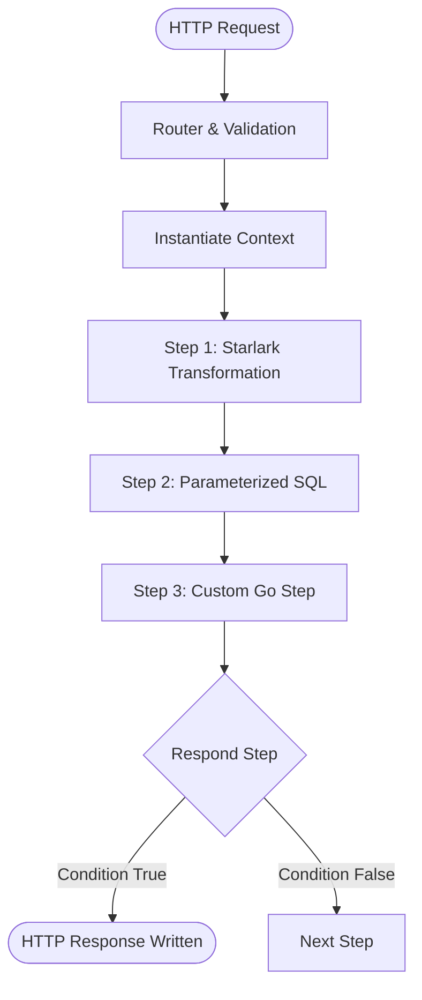

# Pipeline state machine

Hclapi models each HTTP endpoint as an ordered, deterministic execution pipeline.

## Architectural lifecycle

## Execution rules

1. **Sequential execution:** Steps execute in exact declaration order.
2. **Context mutation:** Each named step persists its output into `ctx.Steps[<step_name>].Result`.
3. **Terminal response:** When a `respond` step executes (and its condition evaluates to true), the HTTP status and payload are written, and pipeline execution halts immediately.
4. **Panic containment:** In-process Go step extensions run behind panic recovery boundaries, converting runtime panics into controlled HTTP 500 responses without crashing the host process.
