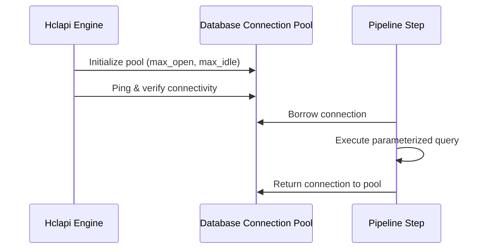

# Connections & pools

The `connection` block configures persistent I/O resources, including database connection pools and cache clients.

## Connection lifecycle



## Driver support matrix

| Driver | Identifier | Parameter Syntax | Supported Target Systems |
| :--- | :--- | :--- | :--- |
| **PostgreSQL** | `postgres` | `@param` $\rightarrow$ `$1, $2` | PostgreSQL 12+, CockroachDB, AWS Aurora PG |
| **SQLite** | `sqlite` | `@param` $\rightarrow$ `?` | SQLite 3, in-memory instances, Turso |
| **MySQL / MariaDB** | `mysql` | `@param` $\rightarrow$ `?` | MySQL 8.0+, MariaDB 10.5+ |
| **Microsoft SQL Server** | `mssql` | `@param` $\rightarrow$ `@p1, @p2` | SQL Server 2017+, Azure SQL |
| **Redis** | `redis` | Native command arguments | Redis 6.0+, KeyDB, Dragonfly |

## PostgreSQL connection

```hcl
connection "postgres" "primary" {
  url = env("DATABASE_URL")

  pool {
    max_open_conns    = 50
    max_idle_conns    = 10
    conn_max_lifetime = "30m"
    conn_max_idle_time = "5m"
  }
}
```

## SQLite connection

```hcl
connection "sqlite" "local" {
  url = "file:data.db?cache=shared&mode=rwc"

  pool {
    max_open_conns = 1
  }
}
```

## Redis connection

```hcl
connection "redis" "cache" {
  url = env("REDIS_URL")

  pool {
    size         = 20
    idle_timeout = "5m"
  }
}
```
