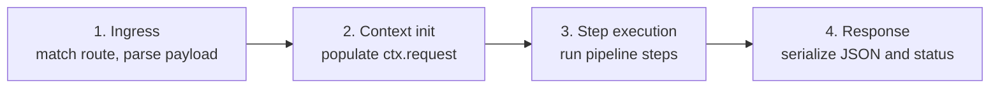

# Request lifecycle

hclapi has two phases. Manifests are validated once, at boot. Every request
after that runs the same fixed pipeline.

| Phase   | Trigger                 | Result                                                  | On failure                                                                 |
| :------ | :---------------------- | :------------------------------------------------------ | :------------------------------------------------------------------------- |
| Boot    | `hclapi serve` starts     | Manifests parsed, connections opened, routes registered | Process exits with a file and line diagnostic                              |
| Request | An HTTP request arrives | Route matched, pipeline runs, response serialized       | Request returns an [RFC 9457](./errors.md) error; server continues running |

A manifest error, invalid HCL, an unresolved `connection` reference, a
malformed `Duration`, prevents the server from starting. A request error, a
failed query, a Starlark exception, a bad body, affects only that request.

## Stages

1. **Ingress.** The method and path are matched against registered routes.
   Headers, query string, and body are parsed.
2. **Context initialization.** A request-scoped [execution context](./context.md)
   is created.
3. **Step execution.** [Pipeline steps](./pipelines.md) run in order, each
   reading from the context and appending its result.
4. **Response.** A `respond` step serializes status, headers, and body, and
   the pipeline terminates.

A request that fails schema validation or arrives with unparseable JSON does
not reach stage three.
