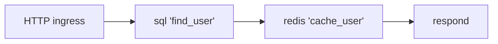

# Pipelines and steps

A pipeline is an ordered sequence of steps declared inside an `endpoint`
block. Each step performs one unit of work and writes its result into the
execution context for subsequent steps to read.



## Step types

| Step                                   | Block                  | Function                                      | Output                                  |
| :------------------------------------- | :--------------------- | :-------------------------------------------- | :-------------------------------------- |
| [sql](../steps/sql.md)                 | `sql "<name>"`         | Parameterized queries and mutations           | `steps.<name>.result`, `.rows_affected` |
| [starlark](../steps/starlark.md)       | `starlark "<name>"`    | Sandboxed data transformation                 | `steps.<name>.result`                   |
| [redis](../steps/redis.md)             | `redis "<name>"`       | Cache reads and writes                        | `steps.<name>.result`                   |
| [go](../steps/go.md)                   | `go "<name>"`          | Invokes a registered Go function              | `steps.<name>.result`                   |
| [transaction](../steps/transaction.md) | `transaction "<name>"` | Atomic multi-statement SQL                    | Aggregated from nested steps            |
| [parallel](../steps/parallel.md)       | `parallel { }`         | Concurrent branch execution                   | Each branch's own output                |
| [respond](../steps/respond.md)         | `respond { }`          | Terminates the pipeline with an HTTP response | None                                    |

## Rules

1. Every step, except `respond` and `parallel`, requires a unique label. The
   label determines its namespace under `ctx.steps`: `sql "find_user"`
   writes to `steps.find_user.result`.
2. A step may read any output written by a prior step. A step may not
   overwrite a prior step's output or modify `ctx.request`.
3. An unhandled error in any step, a query failure, a Starlark exception, a
   Go panic, halts the pipeline immediately and passes control to the
   [error handler](./errors.md). No further steps run.
4. The pipeline terminates at the first `respond` step whose `condition`
   evaluates to `true`, or at the first unconditional `respond`.

A pipeline runs its steps exactly once, top to bottom. There is no looping
or retry construct; conditional branching is expressed through `condition`
on `respond`.

## Example

```hcl
endpoint "GET /api/v1/users/{id}" {
  pipeline {
    sql "find_user" {
      connection = connection.postgres.main
      query      = "SELECT id, name, email FROM users WHERE id = @id"
      args       = { id = ctx.request.path.id }
    }

    respond {
      condition = steps.find_user.rows_affected == 0
      status    = 404
      body      = { error = "User not found" }
    }

    respond {
      status = 200
      body   = steps.find_user.result
    }
  }
}
```

This shape, query a resource, branch on `rows_affected`, respond, recurs
throughout hclapi manifests. See [Patterns](../patterns.md#404-on-a-missing-record).
