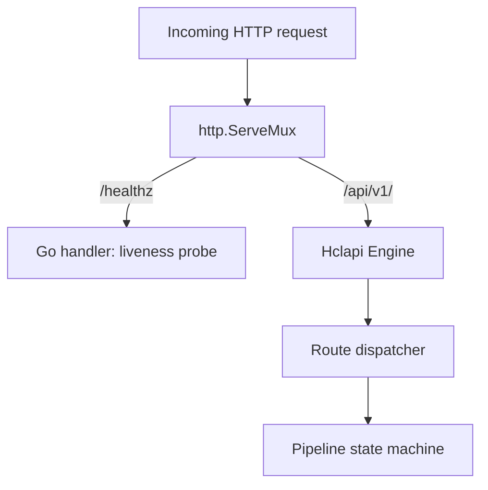

# Embedding

`hclapi.Engine` implements the standard `http.Handler` interface. It mounts
onto any `http.ServeMux`, middleware chain, or third-party router.



## Basic setup

```go
package main

import (
    "context"
    "errors"
    "log/slog"
    "net/http"
    "os"
    "os/signal"
    "syscall"
    "time"

    "github.com/ju4n97/hclapi"
)

func main() {
    logger := slog.New(slog.NewJSONHandler(os.Stdout, nil))

    engine, err := hclapi.NewEngine(hclapi.Options{
        ManifestDir:  "./manifests",
        StrictTyping: true,
        Logger:       logger,
    })
    if err != nil {
        logger.Error("failed to initialize hclapi engine", "error", err)
        os.Exit(1)
    }

    mux := http.NewServeMux()

    mux.HandleFunc("GET /healthz", func(w http.ResponseWriter, r *http.Request) {
        w.WriteHeader(http.StatusOK)
        w.Write([]byte("OK"))
    })

    mux.Handle("/api/v1/", engine.Handler())

    srvConfig := engine.Server()
    server := &http.Server{
        Addr:         ":8080",
        Handler:      mux,
        ReadTimeout:  srvConfig.ReadTimeout.Duration(),
        WriteTimeout: srvConfig.WriteTimeout.Duration(),
        IdleTimeout:  srvConfig.IdleTimeout.Duration(),
    }

    stop := make(chan os.Signal, 1)
    signal.Notify(stop, os.Interrupt, syscall.SIGTERM)

    go func() {
        logger.Info("server listening", "addr", server.Addr)
        if err := server.ListenAndServe(); err != nil && !errors.Is(err, http.ErrServerClosed) {
            logger.Error("server error", "error", err)
            os.Exit(1)
        }
    }()

    <-stop
    ctx, cancel := context.WithTimeout(context.Background(), 5*time.Second)
    defer cancel()
    server.Shutdown(ctx)
}
```

`engine.Server()` returns the settings resolved from the manifest's
`server {}` block, after CLI and environment overrides are applied.

## Middleware

`engine.Handler()` returns a standard `http.Handler`. Ordinary middleware
wraps it without modification.

```go
func loggingMiddleware(next http.Handler) http.Handler {
    return http.HandlerFunc(func(w http.ResponseWriter, r *http.Request) {
        start := time.Now()
        next.ServeHTTP(w, r)
        slog.Info("request completed", "method", r.Method, "path", r.URL.Path, "duration", time.Since(start))
    })
}

handler := loggingMiddleware(engine.Handler())
http.ListenAndServe(":8080", handler)
```
