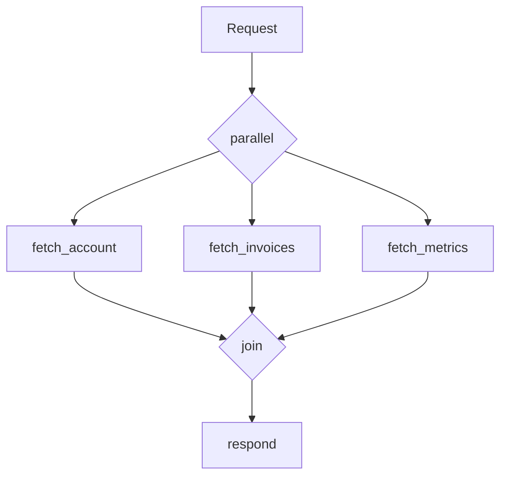

# parallel

Executes multiple steps concurrently, each on a separate goroutine, and
waits for all branches to complete.

## Declaration

```hcl
parallel {
  sql "fetch_account" {
    # branch 1
  }

  sql "fetch_invoices" {
    # branch 2
  }

  redis "fetch_metrics" {
    # branch 3
  }
}
```



## Semantics

1. Each branch executes independently and cannot see other branches'
   results until the block completes.
2. Execution halts at the closing brace until every branch finishes.
3. An error in any branch cancels the remaining branches and fails the
   pipeline.
4. All branches write to `ctx.steps.<name>.result`, available to subsequent
   steps once the block completes.

See [Parallel aggregation](../patterns.md#parallel-aggregation) for a
complete example.
