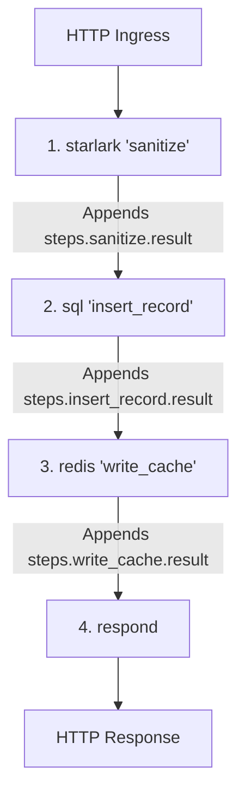

# Steps overview

A pipeline is an ordered sequence of execution steps declared inside an endpoint block. Steps perform isolated units of work, such as database queries, in-memory transformations, cache operations, or native code execution, and pass their outputs forward through the execution context (`ctx`).

## Step runner catalog

Hclapi provides native step runners for distinct execution domains:

| Step type | Block declaration | Primary responsibility | Output namespace |
| :--- | :--- | :--- | :--- |
| **Starlark** | `starlark "<name>"` | In-memory Python data transformations and business rules | `steps.<name>.result` |
| **SQL** | `sql "<name>"` | Parameterized database queries and mutations | `steps.<name>.result`<br>`steps.<name>.rows_affected` |
| **Redis** | `redis "<name>"` | Cache-aside operations and key-value storage | `steps.<name>.result` |
| **Go** | `go "<name>"` | Custom native Go callback execution | `steps.<name>.result` |
| **Transaction** | `transaction "<name>"` | Multi-statement atomic database transaction execution | Aggregated step outputs |
| **Parallel** | `parallel { ... }` | Concurrent branch execution across multiple queries | Individual branch outputs |
| **Respond** | `respond { ... }` | HTTP response serialization and terminal status code delivery | None (terminates pipeline) |

## Execution model

Pipelines execute sequentially from top to bottom. Each step executes in isolation, reads inputs from the current context state, and appends its result under its declared identifier:



## Step lifecycle rules

1. **Explicit naming**: Every step (except `respond` and `parallel`) requires a unique string label. This label defines its namespace under `ctx.steps` (e.g. `sql "fetch_user"` outputs to `steps.fetch_user.result`).
2. **Context immutability**: Steps cannot overwrite previously computed step outputs or mutate `ctx.request` fields. State accumulates monotonically downward.
3. **Error propagation**: If any step encounters an unhandled runtime error (such as a database connection timeout or Starlark execution failure), the pipeline halts immediately, short-circuiting downstream steps and triggering the error handler.
4. **Terminal completion**: A pipeline terminates when a `respond` block evaluates its `condition` to `true` (or when an unconditional `respond` block is reached).

## Combined pipeline example

```hcl
endpoint "POST /api/v1/orders" {
  description = "Validates, persists, caches, and responds with a newly created order"

  pipeline {
    # 1. Transform and sanitize input payload
    starlark "sanitize" {
      source = <<-STARLARK
        def execute(ctx):
          items = ctx.request.body.get("items", [])
          total = sum([item["price"] * item["quantity"] for item in items])
          return {
            "total_cents": total,
            "item_count": len(items)
          }
      STARLARK
    }

    # 2. Persist order to database using sanitized totals
    sql "create_order" {
      connection = connection.postgres.main
      query      = <<-SQL
        INSERT INTO orders (customer_id, total_cents, item_count, status)
        VALUES (@customer_id, @total_cents, @item_count, 'pending')
        RETURNING id, customer_id, total_cents, item_count, status, created_at
      SQL
      args = {
        customer_id = ctx.request.body.customer_id
        total_cents = steps.sanitize.result.total_cents
        item_count  = steps.sanitize.result.item_count
      }
    }

    # 3. Cache newly created order in Redis
    redis "cache_order" {
      connection = connection.redis.cache
      command    = "SET"
      key        = "order:${steps.create_order.result.id}"
      value      = json_encode(steps.create_order.result)
      ttl        = "1h"
    }

    # 4. Final HTTP response
    respond {
      status = 201
      body   = steps.create_order.result
    }
  }
}
```
