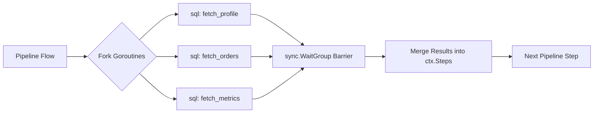

# Parallel step

The `parallel` block executes child steps concurrently across worker goroutines.

## Concurrency model



## Syntax

```hcl
parallel {
  sql "fetch_profile" {
    connection = connection.postgres.main
    query      = "SELECT * FROM users WHERE id = @id"
    args       = { id = ctx.request.path.id }
  }

  sql "fetch_orders" {
    connection = connection.postgres.main
    query      = "SELECT * FROM orders WHERE user_id = @id LIMIT 5"
    args       = { id = ctx.request.path.id }
  }

  sql "fetch_notifications" {
    connection = connection.postgres.main
    query      = "SELECT * FROM notifications WHERE user_id = @id LIMIT 10"
    args       = { id = ctx.request.path.id }
  }
}
```
