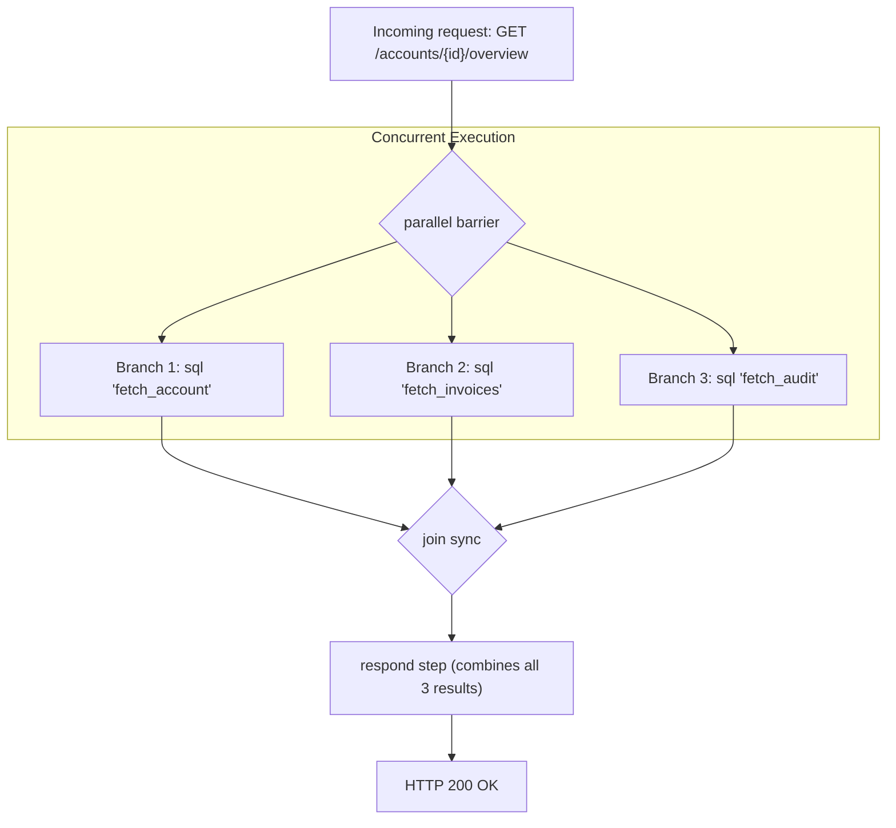

# Parallel

The `parallel` block executes multiple independent pipeline steps concurrently across separate goroutines. 

## Block declaration

```hcl
parallel {
  sql "fetch_account" {
    # Branch 1
  }

  sql "fetch_invoices" {
    # Branch 2
  }

  redis "fetch_metrics" {
    # Branch 3
  }
}
```

## Execution semantics



1. **Independent execution**: Each step within the `parallel` block runs in its own worker thread.
2. **Synchronization barrier**: The pipeline halts at the end of the `parallel` block until all concurrent branches have finished.
3. **Fail-fast cancellation**: If any branch encounters an error, remaining concurrent operations are signaled to abort, and the pipeline terminates with the error.
4. **Namespace availability**: All branches write their results to `ctx.steps.<name>.result`, making them simultaneously available to subsequent steps.

## Dashboard aggregation example

```hcl
endpoint "GET /api/v1/accounts/{id}/overview" {
  description = "Aggregates account details, invoices, and audit events concurrently"

  request {
    path {
      field "id" {
        type     = int
        required = true
      }
    }
  }

  pipeline {
    # Execute three isolated database queries concurrently
    parallel {
      sql "fetch_account" {
        connection = connection.postgres.main
        query      = "SELECT id, name, tier FROM accounts WHERE id = @id"
        args       = { id = ctx.request.path.id }
      }

      sql "fetch_invoices" {
        connection = connection.postgres.main
        query      = <<-SQL
          SELECT id, amount_cents, status, issued_at
          FROM invoices
          WHERE account_id = @id
          ORDER BY issued_at DESC
          LIMIT 5
        SQL
        args = { id = ctx.request.path.id }
      }

      sql "fetch_audit" {
        connection = connection.postgres.main
        query      = <<-SQL
          SELECT id, action, created_at
          FROM audit_logs
          WHERE account_id = @id
          ORDER BY created_at DESC
          LIMIT 10
        SQL
        args = { id = ctx.request.path.id }
      }
    }

    # Check 404 on account record
    respond {
      condition = steps.fetch_account.rows_affected == 0
      status    = 404
      body      = { error = "Account not found" }
    }

    # Aggregate all three parallel branch results into single JSON response
    respond {
      status = 200
      body = {
        account         = steps.fetch_account.result
        recent_invoices = steps.fetch_invoices.result
        recent_events   = steps.fetch_audit.result
      }
    }
  }
}
```
