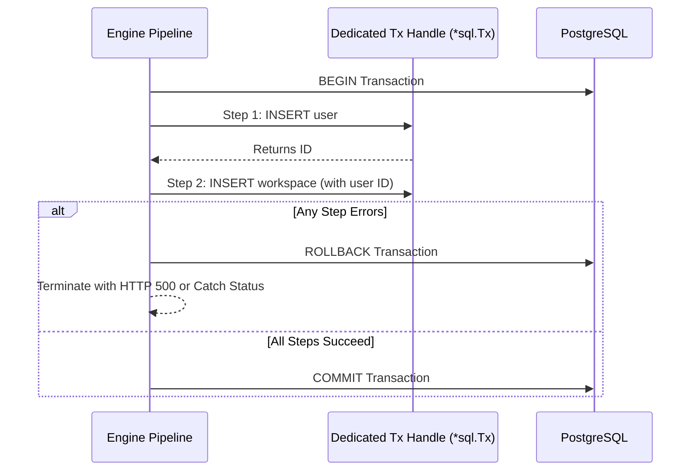

# Transaction step

The `transaction` block groups multiple database operations into an atomic transaction.

## Transaction lifecycle



## Syntax

```hcl
transaction "provision_account" {
  connection = connection.postgres.main

  sql "create_user" {
    query = "INSERT INTO users (email) VALUES (@email) RETURNING id"
    args  = { email = ctx.request.body.email }
  }

  sql "create_profile" {
    query = "INSERT INTO profiles (user_id, name) VALUES (@uid, @name)"
    args = {
      uid  = steps.create_user.result.id
      name = ctx.request.body.name
    }
  }
}
```

## Rollback semantics

* All enclosed `sql` operations execute on a single dedicated transaction handle (`*sql.Tx`).
* If any enclosed step fails, or if an unhandled error occurs, the transaction automatically issues a `ROLLBACK`.
* Successful completion of the final child step triggers an explicit `COMMIT`.
